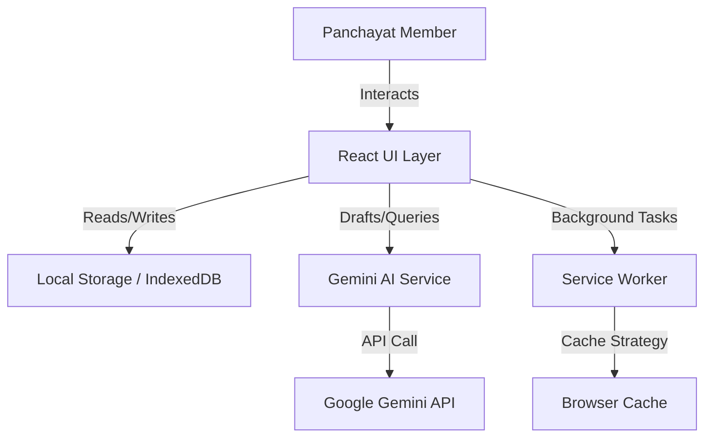

# GramSahayak - System Design Document

## 1. High-Level Design (HLD)

### 1.1 System Overview
GramSahayak is a **Progressive Web Application (PWA)** designed to digitally empower Gram Panchayat members in India. It operates on a **Local-First** architecture, ensuring functionality in low-connectivity rural areas while leveraging Cloud AI for advanced tasks.

### 1.2 Architecture Diagram


### 1.3 Key Modules
1.  **Core Dashboard**: Aggregates ward status, grievance statistics, and quick actions.
2.  **Jan Sunwai (Grievance Engine)**: A CRUD system for logging villager complaints with status tracking and priority tagging.
3.  **AI Karyalaya (Drafting Engine)**: A prompt-engineering layer that acts as a bridge between structured user inputs and the LLM to generate official correspondence.
4.  **Security Module**: Implements dual-layer security (PIN + WebAuthn Biometrics) to protect sensitive village data.
5.  **Localization Engine**: A context-aware translation system supporting 10 Indic languages.

### 1.4 Data Flow
1.  **User Input**: User enters data (e.g., grievance details) in their local language.
2.  **State Management**: React State updates immediately for UI responsiveness.
3.  **Persistence**: `useEffect` hooks trigger synchronization to `localStorage` for offline persistence.
4.  **AI Enhancement**: For drafting, data is sanitized and sent to Gemini API via `geminiService`.
5.  **Output**: AI response is formatted (Markdown/Text) and presented to the user.

---

## 2. Low-Level Design (LLD)

### 2.1 Technology Stack
*   **Frontend**: React 18 (Functional Components, Hooks).
*   **Build System**: Vite (for optimized production bundling).
*   **Styling**: Tailwind CSS (Utility-first, Theme-aware using CSS variables).
*   **Storage**: `window.localStorage` (JSON serialization).
*   **AI**: `@google/genai` SDK.
*   **Routing**: Tab-based conditional rendering (Single Page Application).

### 2.2 Component Hierarchy
*   `App.tsx` (Main Controller, State Container)
    *   `Layout.tsx` (Shell, Navigation, Header)
        *   `Dashboard.tsx` (Visualization, Stats)
        *   `GrievanceLog.tsx` (List View, Filtering)
            *   `GrievanceDetails.tsx` (Detail View, Action History)
        *   `ScheduleManager.tsx` (Calendar, Itinerary)
        *   `LetterDrafter.tsx` (AI Form Interface)
        *   `BroadcastManager.tsx` (WhatsApp Integration)
    *   `AppLock.tsx` (Security Overlay)
    *   `Registration.tsx` (Onboarding)

### 2.3 Data Models (Schema)

#### Grievance Entity
Relationship: 1 Grievance -> Many Actions
```typescript
interface Grievance {
  id: string;           // UUID or Timestamp
  citizenName: string;
  category: Enum;       // WATER, ROADS, etc.
  status: Enum;         // PENDING, RESOLVED
  priority: Enum;       // HIGH, LOW
  actions: Action[];    // Audit trail
}
```

#### Event Entity
Relationship: 1 Event -> Optional 1 Grievance
```typescript
interface CalendarEvent {
  id: string;
  date: string;         // ISO YYYY-MM-DD
  type: Enum;           // MEETING, VISIT
  grievanceId?: string; // Foreign Key to Grievance
}
```

### 2.4 Security Implementation
*   **PIN Logic**: Simple string comparison against stored hash (simulated via local storage for MVP).
*   **Biometrics**: Uses the **Web Authentication API (WebAuthn)**.
    *   `navigator.credentials.create()`: Registers the device authenticator.
    *   `navigator.credentials.get()`: Verifies the user via Fingerprint/FaceID.

### 2.5 AI Prompt Engineering Strategy
The `geminiService.ts` does not just pass user queries. It wraps them in **System Instructions**:
1.  **Role Definition**: "You are an assistant for a Panchayat Member."
2.  **Context Injection**: Injects User Name, Ward Number, and Panchayat Name into the prompt signature.
3.  **Output Formatting**: Enforces "Official Tone" or "WhatsApp Style" based on the module.
4.  **Language Handling**: Explicitly requests output in the target Indic language script.
